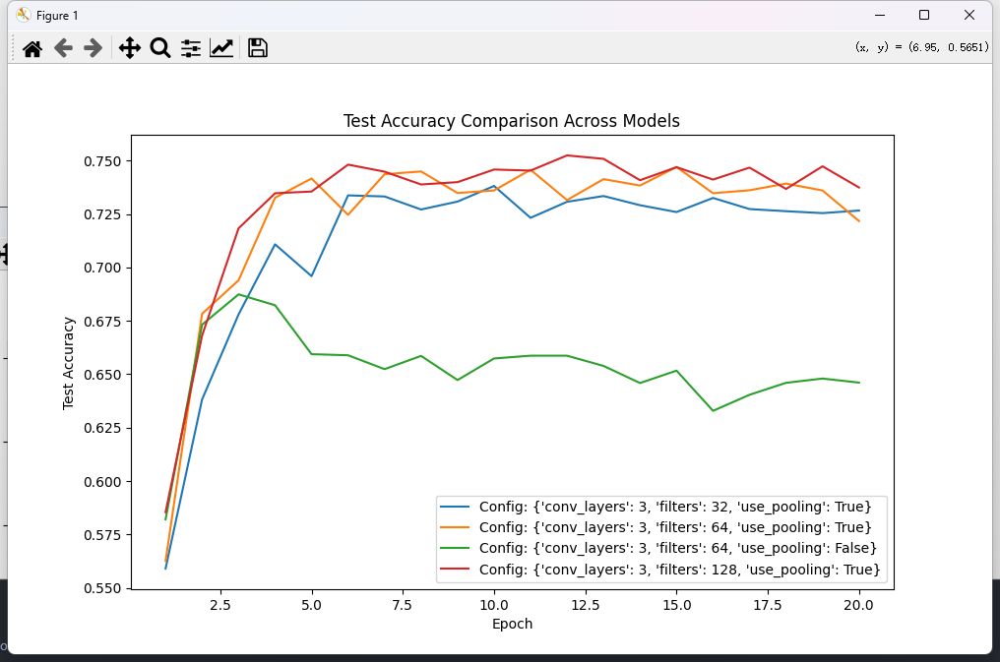

# 2024Fall机器学习与数据挖掘 ——作业二

学号：22336084

姓名：胡舸耀

## 一、实验环境

python：3.10.13

编译器：vscode

## 二、实验要求

1) 在给定的训练数据集上，分别训练一个线性分类器（Softmax 分类器），多层感知机（MLP）和卷积神经网络（CNN）
2) 在 MLP 实验中，研究使用不同网络层数和不同神经元数量对模型性能的影响
3) 在 CNN 实验中，以 LeNet 模型为基础，探索不同模型结构因素（如：卷积层数、滤波器数量、Pooling 的使用等）对模型性能的影响
4) 分别使用 SGD 算法、SGD Momentum 算法和 Adam 算法训练模型，观察并讨论他们对模型训练速度和性能的影响
5) 比较并讨论线性分类器、MLP 和 CNN 模型在 CIFAR-10 图像分类任务上的性能区别
6) 学习一种主流的深度学习框架（如：Tensorfolw，PyTorch，MindSpore），并用其中一种框架完成上述神经网络模型的实验

## 三、实验过程

### 3.0 数据导入

我们可以在数据的文件夹中找到导入数据的函数，如下：


在数据中可以看到，训练数据包含5个batch，以及一个测试batch，在这里我进行修改，使得导入数据更清晰、增加报错反馈以及增添了转化为 `(N, 32, 32, 3)`的功能

```python
def load_data(dir):
    """
    加载 CIFAR-10 数据集。
  
    参数:
    dir (str): 数据集文件所在的目录路径。
  
    返回:
    tuple: (X_train, Y_train, X_test, Y_test)，分别是训练数据、训练标签、测试数据、测试标签。
    """
    def load_batch(file_path):
        """加载单个批次的 CIFAR-10 数据。"""
        with open(file_path, 'rb') as fo:
            data_dict = pickle.load(fo, encoding='bytes')
            data = data_dict[b'data']
            labels = data_dict[b'labels']
            return data, labels

    # 检查路径是否存在
    if not os.path.exists(dir):
        raise ValueError(f"指定的目录 {dir} 不存在！请检查路径。")
  
    # 加载训练数据
    X_train, Y_train = [], []
    for i in range(1, 6):
        file_path = os.path.join(dir, f'data_batch_{i}')
        data, labels = load_batch(file_path)
        X_train.append(data)
        Y_train += labels
    X_train = np.concatenate(X_train, axis=0)
    Y_train = np.array(Y_train)

    # 加载测试数据
    test_file_path = os.path.join(dir, 'test_batch')
    X_test, Y_test = load_batch(test_file_path)
    X_test = np.array(X_test)
    Y_test = np.array(Y_test)

    # # 数据形状调整
    # X_train = X_train.reshape(-1, 3, 32, 32).transpose(0, 2, 3, 1)  # 转为 (N, 32, 32, 3)
    # X_test = X_test.reshape(-1, 3, 32, 32).transpose(0, 2, 3, 1)    # 转为 (N, 32, 32, 3)

    return X_train, Y_train, X_test, Y_test
```

同时，为了检测数据是否正确导入，我添加了数据检查程序：

```python
# 数据检测
data_dir = './data'

# 加载数据
X_train, Y_train, X_test, Y_test = load_data(data_dir)

print(f"训练数据: {X_train.shape}, 训练标签: {Y_train.shape}")
print(f"测试数据: {X_test.shape}, 测试标签: {Y_test.shape}")
```

导入正确时会输出如下：


这和我们数据格式相同。

在上述基础上，增添了数据预处理过程，将图像数据标准化：

```python
# 数据预处理函数
def preprocess_data(X_train, X_test):
    """将图像数据标准化为 [0, 1] 范围，并展平为向量。"""
    X_train = X_train / 255.0  # 归一化
    X_test = X_test / 255.0
    # X_train = X_train.reshape(X_train.shape[0], -1)  # 展平
    # X_test = X_test.reshape(X_test.shape[0], -1)
    return X_train, X_test
```

之后在主函数中加入导入数据过程，以及实现了数据打乱过程（使得实验数据分布更均匀，训练效果更好）

```python
def main():
    # 参数设置
    data_dir = './data'  # CIFAR-10 数据路径
    seed = 42
    # 加载数据
    X_train, Y_train, X_test, Y_test = load_data(data_dir)
    X_train, X_test = preprocess_data(X_train, X_test)

    # 随机打乱训练数据
    X_train, Y_train = shuffle(X_train, Y_train, random_state=seed)# 种子为42
    X_test, Y_test = shuffle(X_test, Y_test, random_state=seed)
```

### 3.1 softmax的实现

softmax函数表示如下公式：

$$
Softmax(Z_i)=\frac{exp(z_i)}{\sum _j exp(z_j)}
$$

首先定义Softmax 分类器模型：

```python
# Softmax 分类器模型定义
class SoftmaxClassifier(nn.Module):
    def __init__(self, input_size, num_classes):
        super(SoftmaxClassifier, self).__init__()
        self.linear = nn.Linear(input_size, num_classes)
  
    def forward(self, x):
        return self.linear(x)
```

定义并实现训练函数，同时实现了loss函数的可视化：

```python
# 模型训练函数
def train_model(model, train_loader, criterion, optimizer, device, num_epochs=10):
    model.to(device)
    model.train()
    epoch_losses = []  # 记录每个 epoch 的平均损失
    for epoch in range(num_epochs):
        total_loss = 0
        for images, labels in train_loader:
            images, labels = images.to(device), labels.to(device)
  
            # 前向传播
            outputs = model(images)
            loss = criterion(outputs, labels)
  
            # 反向传播
            optimizer.zero_grad()
            loss.backward()
            optimizer.step()
  
            total_loss += loss.item()
  
        avg_loss = total_loss / len(train_loader)
        epoch_losses.append(avg_loss)
        print(f"Epoch [{epoch+1}/{num_epochs}], Loss: {avg_loss:.4f}")

    # # 绘制损失曲线
    # plt.figure(figsize=(8, 6))
    # plt.plot(range(1, num_epochs + 1), epoch_losses, label="Training Loss", marker='o')
    # plt.xlabel("Epochs")
    # plt.ylabel("Loss")
    # plt.title("Training Loss Over Epochs")
    # plt.legend()
    # plt.grid()
    # plt.show()
```

定义并实现测试函数，作为模型性能评估，以测试准确率做评估标准：

```python
# 模型评估函数
def evaluate_model(model, test_loader, device):
    model.eval()
    y_true = []
    y_pred = []
    with torch.no_grad():
        for images, labels in test_loader:
            images, labels = images.to(device), labels.to(device)
            outputs = model(images)
            _, predicted = torch.max(outputs, 1)  # 获取预测结果
  
            y_true.extend(labels.cpu().numpy())
            y_pred.extend(predicted.cpu().numpy())
  
    # 使用准确率作为评估指标
    accuracy = accuracy_score(y_true, y_pred)
    print(f"Test Accuracy: {accuracy:.4f}")
    return accuracy
```

为了实现MLP函数的封装，进行更好的调用以及加密，最后实现模型训练并封装，调用之前实现的函数，并进行超参设置（超参分析放在实验结果与分析中）：

```python
# 模型运行实现
def train_softmax(X_train, Y_train, X_test, Y_test):
    # 超参设置
    batch_size = 32
    num_epochs = 100
    learning_rate = 0.001
    num_classes = 10
    input_size = 32 * 32 * 3  # CIFAR-10 图像展平为 3072

    # 转换为 Tensor 并创建 DataLoader
    train_dataset = torch.utils.data.TensorDataset(torch.tensor(X_train, dtype=torch.float32),
                                                    torch.tensor(Y_train, dtype=torch.long))
    test_dataset = torch.utils.data.TensorDataset(torch.tensor(X_test, dtype=torch.float32),
                                                   torch.tensor(Y_test, dtype=torch.long))
    train_loader = torch.utils.data.DataLoader(train_dataset, batch_size=batch_size, shuffle=True)
    test_loader = torch.utils.data.DataLoader(test_dataset, batch_size=batch_size, shuffle=False)

    # 定义模型、损失函数和优化器
    device = torch.device('cuda' if torch.cuda.is_available() else 'cpu')
    print(device) # 显示使用cpu或cuda
    model = SoftmaxClassifier(input_size, num_classes)
    criterion = nn.CrossEntropyLoss()  # 交叉熵损失
    optimizer = optim.SGD(model.parameters(), lr=learning_rate)

    # 训练模型
    train_model(model, train_loader, criterion, optimizer, device, num_epochs=num_epochs)

    # 评估模型
    evaluate_model(model, test_loader, device)
```

到此，softmax模型就实现完成了，我们调用时只需要调用 `train_softmax`函数即可实现使用 `train_softmax(X_train, Y_train, X_test, Y_test)`

### 3.2 MLP(多层感知机)的实现

多层感知机（MLP，Multilayer Perceptron）也叫人工神经网络（ANN，Artificial Neural Network），除了输入输出层，它中间可以有多个隐层，最简单的MLP只含一个隐层，即三层的结构，如下图：


层与层之间全连接，通过加权叠加到下一个神经元，最后通过激活函数输出。

在训练时，通过输出的结果与标签的结果进行损失函数的计算，根据计算的结果进行方向传播，调整神经元在向前传播过程时的权重值，这就是MLP的基本原理。

接下来我们在代码上进行实现：

在这里，我们要对比不同神经元数量以及层数对准确率的影响，我在这里采用了动态神经元层数以及数量的模型实现：

```python
# 动态定义 MLP 模型
class MLP(nn.Module):
    def __init__(self, input_size, hidden_layers, num_classes):
        """
        动态定义 MLP 模型。
  
        参数:
        input_size (int): 输入层大小（如 CIFAR-10 的 3072）。
        hidden_layers (list): 每层隐藏层神经元数量（如 [128, 64] 表示两层，分别有 128 和 64 个神经元）。
        num_classes (int): 输出类别数量（如 CIFAR-10 的 10）。
        """
        super(MLP, self).__init__()
        layers = []
        prev_size = input_size
        for hidden_size in hidden_layers:
            layers.append(nn.Linear(prev_size, hidden_size))
            layers.append(nn.ReLU())  # 使用 ReLU 激活函数
            prev_size = hidden_size
        layers.append(nn.Linear(prev_size, num_classes))  # 输出层
        self.network = nn.Sequential(*layers)

    def forward(self, x):
        return self.network(x)
```

通过设置一系列 `hidden_layers`的列表，我们可以一次性实现多个不同层数不同神经元数量的MLP网络，然后可以将结果保存起来，进行可视化对比。

接下来类似于softmax网络，进行模型训练和评估函数：

```python
# 模型训练函数（与之前类似）
def train_model(model, train_loader, criterion, optimizer, device, num_epochs=10):
    model.to(device)
    model.train()
    for epoch in range(num_epochs):
        total_loss = 0
        for images, labels in train_loader:
            images, labels = images.to(device), labels.to(device)

            # 前向传播
            outputs = model(images)
            loss = criterion(outputs, labels)

            # 反向传播
            optimizer.zero_grad()
            loss.backward()
            optimizer.step()

            total_loss += loss.item()

        avg_loss = total_loss / len(train_loader)
        print(f"Epoch [{epoch+1}/{num_epochs}], Loss: {avg_loss:.4f}")

# 模型评估函数
def evaluate_model(model, test_loader, device):
    model.eval()
    y_true = []
    y_pred = []
    with torch.no_grad():
        for images, labels in test_loader:
            images, labels = images.to(device), labels.to(device)
            outputs = model(images)
            _, predicted = torch.max(outputs, 1)
            y_true.extend(labels.cpu().numpy())
            y_pred.extend(predicted.cpu().numpy())
    accuracy = accuracy_score(y_true, y_pred)
    return accuracy
```

因为我们实现了不同神经元和层数的MLP网络，所以我们需要建立一个存储变量将不同MLP网络的结果保存下来，建立 `run_experiments`函数进行训练并保存结果

```python
# 实验运行函数
def run_experiments(hidden_layer_configs, train_loader, test_loader, input_size, num_classes, device, num_epochs=10, lr=0.01):
    results = []
    for config in hidden_layer_configs:
        print(f"\nTraining MLP with layers: {config}")
        model = MLP(input_size, config, num_classes).to(device)
        criterion = nn.CrossEntropyLoss()
        optimizer = optim.Adam(model.parameters(), lr=lr)

        # 训练模型
        train_model(model, train_loader, criterion, optimizer, device, num_epochs)

        # 测试模型
        accuracy = evaluate_model(model, test_loader, device)
        print(f"Test Accuracy with layers {config}: {accuracy:.4f}")
        results.append((config, accuracy))
    return results
```

为了实现MLP函数的封装，进行更好的调用以及加密，建立 `train_MLP`，定义相关超参值，训练MLP模型，并实现可视化

```python
# 训练MLP模型生成结果
def train_MLP(X_train, Y_train, X_test, Y_test):
    # 超参设置
    lr = 0.001
    batch_size = 64
    num_epochs = 50
    num_classes = 10
    input_size = 32 * 32 * 3  # CIFAR-10 图像展平为 3072
    # 隐藏层配置列表
    hidden_layer_configs = [
        [256, 128],
        [256, 128, 64],
        [128, 64, 32, 16],
        [256, 128, 64, 32],
    ]

     # 转换为 Tensor 并创建 DataLoader
    train_dataset = torch.utils.data.TensorDataset(torch.tensor(X_train, dtype=torch.float32),
                                                    torch.tensor(Y_train, dtype=torch.long))
    test_dataset = torch.utils.data.TensorDataset(torch.tensor(X_test, dtype=torch.float32),
                                                   torch.tensor(Y_test, dtype=torch.long))
    train_loader = torch.utils.data.DataLoader(train_dataset, batch_size=batch_size, shuffle=True)
    test_loader = torch.utils.data.DataLoader(test_dataset, batch_size=batch_size, shuffle=False)

    # 定义设备
    device = torch.device('cuda' if torch.cuda.is_available() else 'cpu')
    print(device)
  

    # 运行实验
    results = run_experiments(hidden_layer_configs, train_loader, test_loader, input_size, num_classes, device, num_epochs, lr)

    # 可视化结果
    configs = [str(config) for config, _ in results]
    accuracies = [accuracy for _, accuracy in results]
    plt.figure(figsize=(10, 6))
    plt.barh(configs, accuracies, color='skyblue')
    plt.xlabel("Accuracy")
    plt.ylabel("Hidden Layer Configuration")
    plt.title("MLP Performance with Different Hidden Layer Configurations")
    plt.grid(axis='x')
    plt.show()
```

到这里MLP就已经实现了，具体优化器选择对比放在实验结果中。调用MLP时只需要在主函数中调用 `train_MLP(X_train, Y_train, X_test, Y_test)`即可。

### 3.3 CNN(卷积神经网络)的实现

卷积神经网络（Convolutional Neural Network，简称 CNN）是一种深度学习模型，专门用于处理具有类似网格结构的数据，例如图像（二维网格）和视频（时间与空间的二维网格）。CNN 是深度学习中最常用的模型之一，尤其在计算机视觉任务中表现出色，如图像分类、目标检测、语义分割等。

CNN 的主要特点是  **卷积层** ，它能够自动从数据中提取特征，减少对手动特征提取的依赖。CNN 通常包含多个层次结构，其中每一层都对输入数据进行不同程度的处理。

CNN 的结构通常包括以下几层：

* **卷积层（Convolutional Layer）**
* **激活层（Activation Layer）**
* **池化层（Pooling Layer）**
* **全连接层（Fully Connected Layer）**

下面是一个简单图示例：


在CNN中，通过两层卷积层网络连接到全连接层。每个卷积层中通过卷积操作，将一个小的滤波器（也叫卷积核）滑过输入数据，计算滤波器与输入数据的点积，得到输出的特征图（Feature Map）。每个卷积核都会学习到一种特定的特征（例如边缘、角点、纹理等），再通过非线性的激活函数输入到下一层中。在示例中通过卷积激活层后，输入到池化层中，池化层通常位于卷积层之后，用于减少特征图的尺寸，从而减少计算量和内存消耗，同时保留重要的特征。通过两个卷积池化操作后，将特征输入到全连接层中，在卷积和池化层提取了局部特征后，全连接层负责将这些特征映射到最终的输出类别。全连接层的每一个神经元都与前一层的所有神经元相连接。它将卷积和池化操作的输出进行展平，并通过多层神经元组合出最终的预测结果（如分类）。

讲解完示例后进行我们的实验，我们选用最简单的LeNet模型，因为要探究不同模型结构因素对模型性能的影响，我在这里建立LeNet模型时同样建立了可变的LeNet模型，使得实验操作更加简洁。

定义可变LeNet如下：

```python
class LeNet(nn.Module):
    def __init__(self, input_channels=3, num_classes=10, conv_layers=2, filters=32, use_pooling=True):
        super(LeNet, self).__init__()
        self.use_pooling = use_pooling
        self.conv_layers = conv_layers

        # 构建卷积部分
        layers = []
        in_channels = input_channels
        for i in range(conv_layers):
            layers.append(nn.Conv2d(in_channels, filters * (2 ** i), kernel_size=3, padding=1))
            layers.append(nn.ReLU())
            if use_pooling:
                layers.append(nn.MaxPool2d(kernel_size=2, stride=2))
            in_channels = filters * (2 ** i)

        self.feature_extractor = nn.Sequential(*layers)

        # 动态计算全连接层输入大小
        self.feature_dim = self._get_feature_dim(input_channels, 32, 32)
        self.classifier = nn.Sequential(
            nn.Linear(self.feature_dim, 120),
            nn.ReLU(),
            nn.Linear(120, 84),
            nn.ReLU(),
            nn.Linear(84, num_classes)
        )

    def _get_feature_dim(self, channels, height, width):
        # 通过一层一层的模拟前向传播计算特征展平维度
        x = torch.zeros(1, channels, height, width)  # 生成一个虚拟输入
        x = self.feature_extractor(x)
        return x.numel()

    def forward(self, x):
        x = self.feature_extractor(x)
        x = torch.flatten(x, start_dim=1)
        x = self.classifier(x)
        return x
```

这里我们注意，因为conv_layers和filters和use_pooling是可变的，在初始化函数中，我们遍历层数，每次在卷积网络中加入卷积核为$2^i*filters$，避免多次调整或设置，如果想要测试不同类型的卷积核分布，可以同样在卷积核输入部分增添列表，定义各个层数的卷积核个数，使得实验更加丰富。

**注意：**对一般的LeNet网络在运行时，你会发现在运行一个网络后，你更换层数和滤波器数目的网络会产生报错，这里是因为你更改滤波器后，全连接输入时的神经元个数是固定的，你需要对每个滤波器的设置进行修改，手动计算出列表才可以正常运行，为了实验的便利，我在这里设计了一个虚拟输入，根据虚拟输入的最后一层输入全连接层时的维度设计全连接层的神经元数量，这样就避免了我们的人工调整，可以自适应你对滤波器和层数的选择。也就是 `def _get_feature_dim(self, channels, height, width):`函数。然后再将连接通过激活函数输入到120*84的网络上，再通过一层进行分类。

在这之后类似与之前的神经网络，对模型进行训练评估：

```python
# 模型训练与评估
def train_and_evaluate(model, train_loader, test_loader, epochs, lr, device):
    model.to(device)
    criterion = nn.CrossEntropyLoss()
    optimizer = optim.Adam(model.parameters(), lr=lr)

    train_accs, test_accs = [], []

    for epoch in range(epochs):
        # 训练阶段
        model.train()
        correct, total = 0, 0
        for images, labels in train_loader:
            images, labels = images.to(device), labels.to(device)
            optimizer.zero_grad()
            outputs = model(images)
            loss = criterion(outputs, labels)
            loss.backward()
            optimizer.step()

            _, predicted = outputs.max(1)
            total += labels.size(0)
            correct += predicted.eq(labels).sum().item()

        train_acc = correct / total
        train_accs.append(train_acc)

        # 测试阶段
        model.eval()
        correct, total = 0, 0
        with torch.no_grad():
            for images, labels in test_loader:
                images, labels = images.to(device), labels.to(device)
                outputs = model(images)
                _, predicted = outputs.max(1)
                total += labels.size(0)
                correct += predicted.eq(labels).sum().item()

        test_acc = correct / total
        test_accs.append(test_acc)

        print(f"Epoch [{epoch + 1}/{epochs}] - Train Acc: {train_acc:.4f}, Test Acc: {test_acc:.4f}")

    return train_accs, test_accs
```

为了方便封装以及超参的调整，我们同样设计 `train_CNN(X_train, Y_train, X_test, Y_test)`函数，在主函数中调用这个函数即可实现模型训练以及可视化。

```python
def train_CNN(X_train, Y_train, X_test, Y_test):
    # 超参设置
    lr = 0.001
    batch_size = 32
    num_epochs = 10
    num_classes = 10
    # 定义实验配置
    experiments = [
        #{"conv_layers": 2, "filters": 64, "use_pooling": True},
        #{"conv_layers": 3, "filters": 32, "use_pooling": True},
        #{"conv_layers": 3, "filters": 64, "use_pooling": True},
        #{"conv_layers": 3, "filters": 64, "use_pooling": False},
        #{"conv_layers": 4, "filters": 64, "use_pooling": True},
        {"conv_layers": 3, "filters": 128, "use_pooling": True},
        #{"conv_layers": 5, "filters": 64, "use_pooling": True},
    ]
  

    # 转换为 Tensor 并创建 DataLoader
    train_dataset = torch.utils.data.TensorDataset(torch.tensor(X_train, dtype=torch.float32),
                                                    torch.tensor(Y_train, dtype=torch.long))
    test_dataset = torch.utils.data.TensorDataset(torch.tensor(X_test, dtype=torch.float32),
                                                   torch.tensor(Y_test, dtype=torch.long))
    train_loader = torch.utils.data.DataLoader(train_dataset, batch_size=batch_size, shuffle=True)
    test_loader = torch.utils.data.DataLoader(test_dataset, batch_size=batch_size, shuffle=False)

  
    device = 'cuda' if torch.cuda.is_available() else 'cpu'
    print(device)

    results = {}

    for config in experiments:
        print(f"\nTraining with config: {config}")
        model = LeNet(num_classes=num_classes, **config)
        train_accs, test_accs = train_and_evaluate(model, train_loader, test_loader, num_epochs, lr, device)
        results[str(config)] = (train_accs, test_accs)

    # 可视化不同模型的准确率对比
    plt.figure(figsize=(10, 6))
    for config, (train_accs, test_accs) in results.items():
        plt.plot(range(1, num_epochs + 1), test_accs, label=f"Config: {config}")
    plt.xlabel("Epoch")
    plt.ylabel("Test Accuracy")
    plt.title("Test Accuracy Comparison Across Models")
    plt.legend()
    plt.show()
```

想要测试不同层和不同滤波器数量时只需要按照相同格式调整experiments即可。

### 注：代码运行注意

#### 全部实验均使用cuda加速，本地显卡型号为4060Ti

#### 所有神经网络进行封装，在主函数中直接调用train函数即可调用对应函数，其中CNN神经网络数据预处理过程不一样，需要将不需要的代码注释

## 四、实验结果与分析

### 4.1 softmax

超参表如下：

|    超参名    | 数据大小 |          含义          |
| :-----------: | :------: | :--------------------: |
|  batch_size  |    32    | 每次训练数据的样本大小 |
|  num_epochs  |   100   |     训练循环的次数     |
| learning_rate |  0.001  |         学习率         |
|  num_classes  |    10    |         分类数         |

batch_size在32或64时表现没有明显差距，任选一即可

num_epochs在学习率为0.01时，训练50次时，loss曲线没有明显收敛，100时已明显收敛，故选择100

$epochs=50$


$epoch=100$


learning_rate选择是0.01和0.001，当0.01时，我们选择epochs为20，和0.001，epochs为100作为对比（图片按提起顺序排布）


可以看到学习率为0.001时，准确率偏高，选择学习率为0.001

num_classes共有十类，为10

实验结果如下：


在 CIFAR-10 数据集上，因为它无法捕捉复杂的特征，Softmax 分类器通常表现有限（大约 30%-40% 的准确率）。

### 4.2 MLP

|   超参名   | 数据大小 | 含义                   |
| :---------: | -------- | ---------------------- |
| batch_size | 64       | 每次训练数据的样本大小 |
| num_epochs | 50       | 训练循环的次数         |
|     lr     | 0.001    | 学习率                 |
| num_classes | 10       | 分类数                 |

具体参数选择同4.1，通过修改参数进行多次实验，可以得到较为好的模型表现时参数如上


#### 不同神经元数量以及层数我使用以下列表进行对比：

```python
# 隐藏层配置列表
    hidden_layer_configs = [
        [128],
        [64, 32],
        [128,64],
        [256, 128],
        [128,64, 32],
        [256, 128, 64],
        [512, 256,128],
        [256, 128, 64, 32],
        [512, 256, 128, 64],
        [1024, 512, 256, 128],
        [512, 256, 128, 64, 32],
        [1024, 512, 256, 128, 64]
    ]
```

全部进行训练后，可视化得出准确率图表如下：


可以看到，层数较低时，越多的神经元数量（更加复杂的网络）可以表现出更好的性能，当模型层数上升后，较多的神经元反而会限制模型的性能，过于复杂的网络表现不佳，可以看到[256, 128, 64, 32]，这个层数与神经元分布的模型效果最好，准确率大概为0.52。

分析：当层数较少是，我们需要更多的神经元去捕捉数据的特征，才能更好的去调整模型。当层数上升后，模型本身已经足够复杂，过多的神经元反而会影响模型性能，造成过拟合等问题。

#### 这里进行分别使用 SGD 算法、SGD Momentum 算法和 Adam 算法训练模型，观察并讨论他们对模型训练速度和性能的影响

我们采用多次训练并选用不同的优化器，在MLP.py文件中，加入函数 `def train_MLP_with_optimizers(X_train, Y_train, X_test, Y_test):`表示使用不同的优化器训练，并且生成柱状图。

```python
def train_MLP_with_optimizers(X_train, Y_train, X_test, Y_test):
    # 超参设置
    lr = 0.001
    batch_size = 64
    num_epochs = 50
    num_classes = 10
    input_size = 32 * 32 * 3  # CIFAR-10 图像展平为 3072
    hidden_layer_config = [256, 128, 64, 32]  # 固定层配置

    # 转换为 Tensor 并创建 DataLoader
    train_dataset = torch.utils.data.TensorDataset(torch.tensor(X_train, dtype=torch.float32),
                                                    torch.tensor(Y_train, dtype=torch.long))
    test_dataset = torch.utils.data.TensorDataset(torch.tensor(X_test, dtype=torch.float32),
                                                   torch.tensor(Y_test, dtype=torch.long))
    train_loader = torch.utils.data.DataLoader(train_dataset, batch_size=batch_size, shuffle=True)
    test_loader = torch.utils.data.DataLoader(test_dataset, batch_size=batch_size, shuffle=False)

    # 定义设备
    device = torch.device('cuda' if torch.cuda.is_available() else 'cpu')
    print(device)

    # 定义优化器字典
    optimizers = {
        "SGD": lambda model: optim.SGD(model.parameters(), lr=lr),
        "SGD Momentum 0.9": lambda model: optim.SGD(model.parameters(), lr=lr, momentum=0.9),
        "SGD Momentum 0.8": lambda model: optim.SGD(model.parameters(), lr=lr, momentum=0.8),
        "Adam": lambda model: optim.Adam(model.parameters(), lr=lr)
    }

    results = []

    # 运行每种优化器
    for optimizer_name, optimizer_fn in optimizers.items():
        print(f"\nTraining with {optimizer_name}...")
        model = MLP(input_size, hidden_layer_config, num_classes).to(device)
        criterion = nn.CrossEntropyLoss()
        optimizer = optimizer_fn(model)

        # 训练模型
        train_model(model, train_loader, criterion, optimizer, device, num_epochs)

        # 测试模型
        accuracy = evaluate_model(model, test_loader, device)
        print(f"Test Accuracy with {optimizer_name}: {accuracy:.4f}")
        results.append((optimizer_name, accuracy))

    # 可视化结果
    optimizer_names = [name for name, _ in results]
    accuracies = [accuracy for _, accuracy in results]
    plt.figure(figsize=(8, 5))
    plt.bar(optimizer_names, accuracies, color=['skyblue', 'lightgreen', 'coral'])
    plt.xlabel("Optimizer")
    plt.ylabel("Accuracy")
    plt.title("MLP Performance with Different Optimizers")
    plt.ylim(0, 1)  # 设置准确率范围
    plt.grid(axis='y', linestyle='--', alpha=0.7)
    plt.show()
```


SGD ：最基础的优化算法，在复杂任务中表现一般，适用于小型数据集、模型简单、对训练时间要求不高的情况。

SGD Momentum ：通过引入动量项，在陡峭方向上可以快速收敛，同时在平坦方向上抑制震荡。动量项允许优化路径在局部最优点附近继续移动，找到全局最优。但是动量的累积可能在早期训练时引入不必要的偏差。适合中型数据集、需要快速训练且存在复杂损失曲面的情况。

Adam ：适合大规模数据集或深层神经网络，尤其在训练时间受限或难以调参时使用。 会动态调整每个参数的学习率，避免手动调整全局学习率。结合了动量和 RMSProp 优化算法的优点，能够快速降低损失。一般默认使用。

可以看到SGD Momentum 0.9表现最好，此时性能最好。

进一步测试收敛速度，我们在MLP文件夹下新建MLP_opt.py文件，在里面实现每次训练后都进行测试，并且保存下来准确率，再生成折线图进行对比

在train_model函数中加入准确率结果进行保存并返回，然后在train_MLP函数中实现准确率的可视化，代码部分如下：

```python
def train_MLP_with_optimizers(X_train, Y_train, X_test, Y_test):
    # 超参设置
    lr = 0.001
    batch_size = 64
    num_epochs = 100
    num_classes = 10
    input_size = 32 * 32 * 3  # CIFAR-10 图像展平为 3072
    hidden_layer_config = [256, 128, 64, 32]  # 固定层配置

    # 转换为 Tensor 并创建 DataLoader
    train_dataset = torch.utils.data.TensorDataset(torch.tensor(X_train, dtype=torch.float32),
                                                    torch.tensor(Y_train, dtype=torch.long))
    test_dataset = torch.utils.data.TensorDataset(torch.tensor(X_test, dtype=torch.float32),
                                                   torch.tensor(Y_test, dtype=torch.long))
    train_loader = torch.utils.data.DataLoader(train_dataset, batch_size=batch_size, shuffle=True)
    test_loader = torch.utils.data.DataLoader(test_dataset, batch_size=batch_size, shuffle=False)

    # 定义设备
    device = torch.device('cuda' if torch.cuda.is_available() else 'cpu')
    print(f"Using device: {device}")

    # 定义优化器字典
    optimizers = {
        "SGD": lambda model: optim.SGD(model.parameters(), lr=lr),
        "SGD Momentum": lambda model: optim.SGD(model.parameters(), lr=lr, momentum=0.9),
        "Adam": lambda model: optim.Adam(model.parameters(), lr=lr)
    }

    all_accuracies = {}  # 保存每种优化器的准确率变化

    # 运行每种优化器
    for optimizer_name, optimizer_fn in optimizers.items():
        print(f"\nTraining with {optimizer_name}...")
        model = MLP(input_size, hidden_layer_config, num_classes).to(device)
        criterion = nn.CrossEntropyLoss()
        optimizer = optimizer_fn(model)

        # 训练模型并记录准确率
        accuracies = train_model_with_tracking(model, train_loader, test_loader, criterion, optimizer, device, num_epochs)
        all_accuracies[optimizer_name] = accuracies

    # 绘制准确率变化曲线
    plt.figure(figsize=(12, 6))
    for optimizer_name, accuracies in all_accuracies.items():
        plt.plot(range(1, num_epochs + 1), accuracies, label=optimizer_name)
    plt.xlabel("Epoch")
    plt.ylabel("Test Accuracy")
    plt.title("Accuracy Progression for Different Optimizers")
    plt.legend()
    plt.grid(True, linestyle="--", alpha=0.7)
    plt.show()
```

结果如下，为了更好显示收敛速度，我这里将epochs设置为100：


可以看到Adam模型收敛最快，但SGD Momentum的性能表现略优于Adam，SGD两者表现均较差。同时，可以看到40左右前两者均已收敛。epochs设置并无问题

### 4.3 CNN

超参方面只有学习率和epochs需要调节（不包含模型变化，batch_size设置32和64差别不大），首先，均设置lr为0.001，探究层数和滤波器数量和池化层的影响。

#### 检验层数对模型影响：


可以看到滤波器数量均为 64 时，层数为3模型性能表现最好，和 4 差别不大，2 和 5 时表现较差。

当层数较少时，模型的学习能力和表现力有限。只有 2 层卷积层，模型可能无法提取足够复杂的特征。因此，尽管每层的滤波器数量为 64，但模型缺乏足够的层次来捕捉数据中的复杂模式和高层次特征。同时容易过拟合，导致模型性能不断下降。

当层数过多时（如 5 层），每一层的卷积操作会增加模型的计算复杂度和参数数量。随着网络变深，梯度可能会变得越来越小（梯度消失），使得训练变得困难。此外，参数数量过多也可能导致训练不稳定（梯度爆炸）。同样的，也可能导致过拟合现象。

所以在之后实验中我们选择层数为 3 进行实验。3 层的深度通常提供了足够的表达能力来捕捉数据中的复杂特征，同时不会过度增加计算和训练难度。此时，网络能够充分提取低层和高层特征，且模型不容易过拟合或发生梯度问题，因此表现最好。

#### 检验滤波器数目和池化层对模型影响：



当池化层取消后，可以看到准确率下滑严重。

池化层的一个重要功能是下采样，即通过减小特征图的空间尺寸（宽度和高度），减少特征图的维度。没有池化层时，卷积操作的输出特征图会变得非常大，冗余信息过多导致网络无法很好的去提取重要特征。可以看出在CNN网络中，池化层是必要的。

对于不同滤波器数目，如果滤波器过少（如 32 或更少），模型可能无法捕捉到足够多的特征，导致性能下降。如果滤波器过多（如 128 或更高），每层的特征数过多，可能导致计算开销增加、训练不稳定或过拟合，尤其是当层数较多时。

因为这时CNN层数为 3，导致滤波器为 64 和 128 时，模型性能表现差距不大。所以在后面学习率的调整中，我将两者共同训练，同时进行对比。

#### 学习率调整

在之前的实验中，可以看到在epoch>10之后，准确率曲线均已收敛，所以在曲线可以看出收敛情况下均固定为20，减少训练时间。

学习率设为0.01时，模型表现非常糟糕，测试准确率几乎不变，训练准确率也无法提升。明显直接错过最优解或者直接梯度爆炸。

学习率设为0.001为默认情况，如前两个实验中所示，这里不再展示

学习率设为0.002时，如下：


可以看到模型表现不如学习率为0.001时，同时可以注意到滤波器数目为128的模型性能下降更加明显，这可能是因为学习率升高导致训练不稳定。

学习率设为0.0005时，如下：


模型性能略有提升，准确率接近0.775。

学习率设为0.0001时，epochs此时设置为50，出现明显收敛，如下：


性能表现相较于学习率为0.0005时没有明显提高，但是我们可以发现另一个现象，当学习率下降，滤波器为128的表现反而优于64的，这可以表现出当学习率降低，更多的滤波器数目可以更好的去捕捉特征，表现出更好的性能

最后，设置一个中间值0.0003进行测试，如下：


可以看到表现无太大差别。所以最后学习率采用0.0005，表现最好。

### 4.4 性能讨论

总体而言，CNN优于MLP优于softmax，三者准确率表现均不是很高，是因为模型选择时只选择了最基础的模型，没有使用较好的优化模型。例如CNN部分选择残差神经网络或者DenseNet可以显著提高性能，但是受限与算力资源和学习能力，这里只选择简单的模型进行训练对比。

softmax是线性分类器，面对图像分类这种复杂问题显然无法表现出很好的性能。

MLP在训练时直接将图像数据扁平化，忽略了图像中局部区域之间的空间关系，这也是在数据预处理时和CNN不同的原因。对于图像的高维数据，MLP 需要较大的参数量来拟合，这会导致计算资源消耗大且容易过拟合，同样无法表现出较好的性能。

CNN对图像处理等分类任务很友好，通过调整参数以及模型架构可以让性能达到一个良好水平，但是由于模型选择的局限，不能达到on the par with the SOTA，更不可能达到SOTA水平了。当然，还可以通过调整模型参数，模型结构让模型性能更进一步，但由于算力的缺失导致训练比较缓慢，无法多次调整参数训练对比，所以我们只能在简单的参数调整后找到较优解。

## 五、实验感想

这次的实验是机器学习与数据挖掘课程中比较大型的一次实验，较多的数据量以及较多的模型对于我的挑战很大。

在这次实验中我遇到最大的问题就是数据格式的重要性。相比于模型的搭建可以找到相关教程以及从他人的模型中寻找经验，数据的导入以及预处理更让我感到棘手。这次的实验数据是已经处理好的，文件具有具体格式的数据，使得我们在导入时很轻松。但在CNN实验中预处理时我就遇到没有修改导入格式，导致模型刚开始训练就在卷积层报错，显示两者矩阵无法相乘。后面在修改好数据预处理后，使得数据在输入时保证正确的矩阵维度。然后在实现可变动CNN模型时遇到了在实验过程中提到的全连接层无法一一对应的问题，不同的滤波器导致了不同模型全连接层第一层的维度不一样，我在查阅资料和询问他人意见后找到了一个模拟输入的方法来将他解决，在这过程中我学到了很多。

还有一个比较重要的问题就是算力资源的缺失，这点在CNN神经网络中训练时尤为明显。在调用cuda后，每个epoch的训练仍要花费较多的时间，这种大型数据的训练消耗较多的时间导致我将大部分时间花费在等待代码运行上。这也同时体现出当今世界对算力的需求以及人工智能不断发展，模型不断进步的原因。

在这次实验中，对于实验中探究不同模型或者优化器或者其他模型变量时，我都选择了使用可变的模型来构建，这部分使得我更好的去理解模型的本质，通过不同模型参数也可以很好的去构建出相同类别的模型，就像在CNN网络中，无论层数的多少，我们都是在每一层中设置卷积层以及他对应的卷积核个数，再设置激活函数，再设置池化层，通过多次这个步骤后，最后连接到全连接层上进行多分类。这些方法让我更好的去理解模型的原理，收获颇多。
