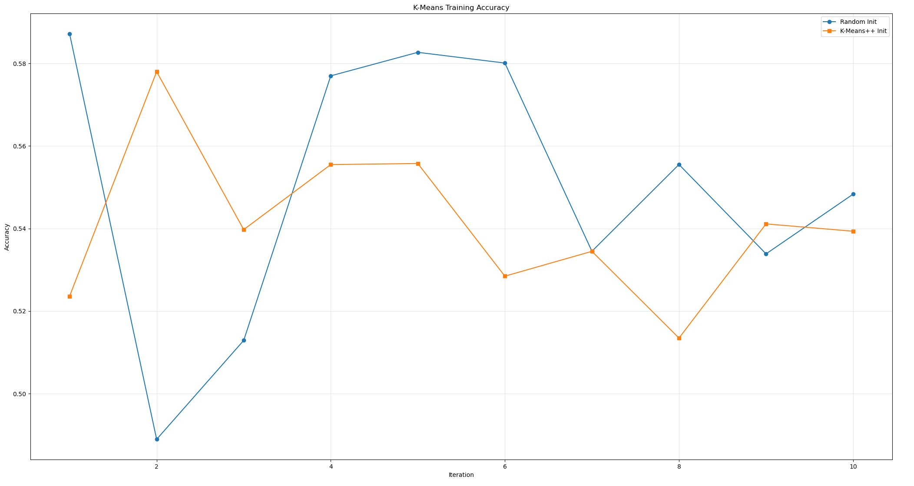
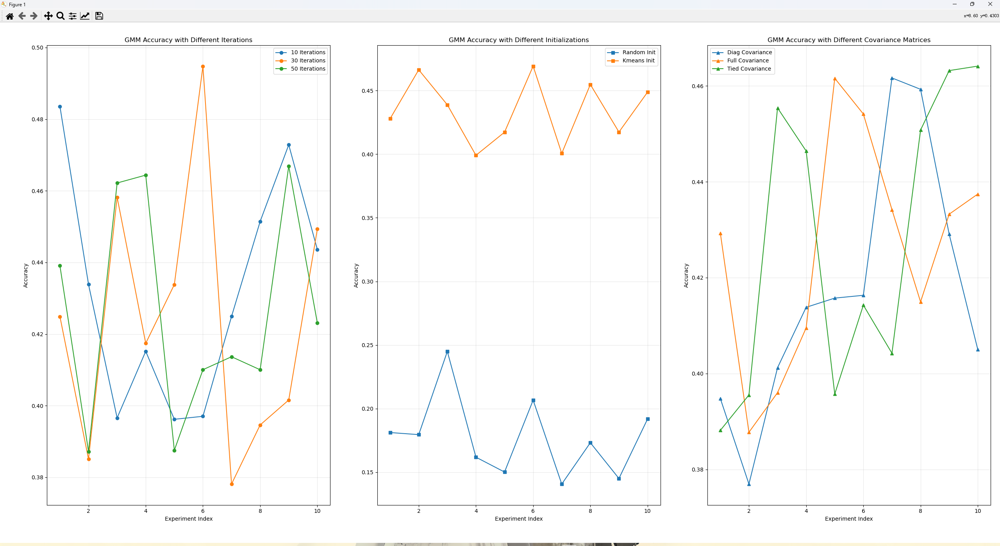
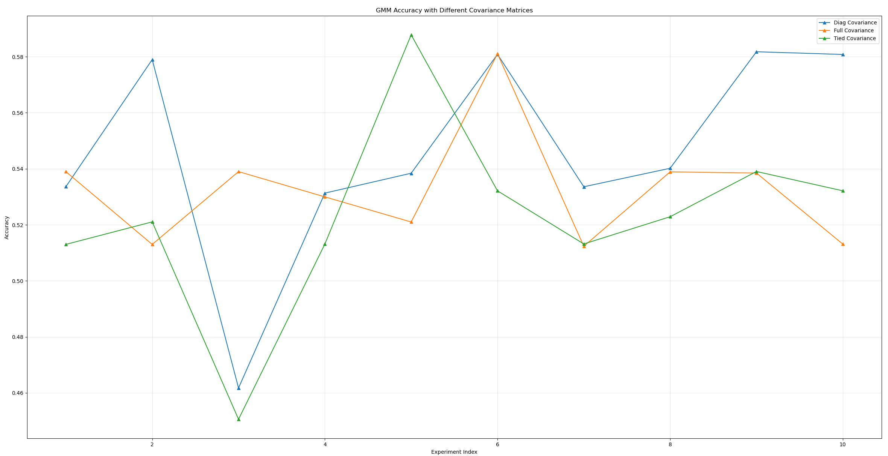
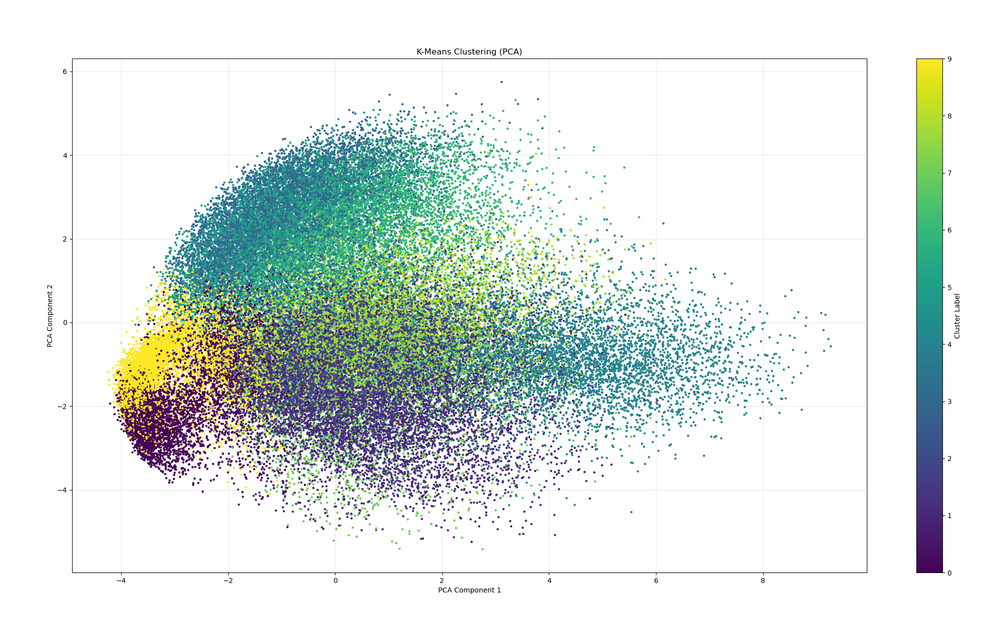
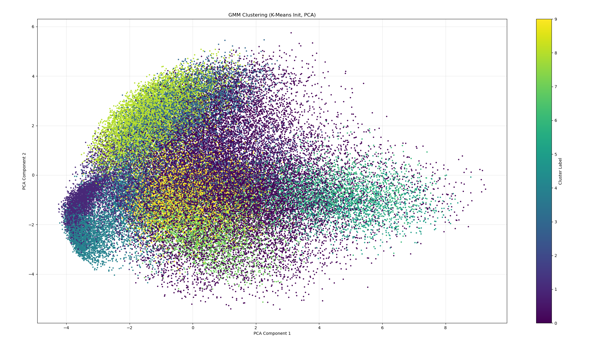

# 2024Fall机器学习与数据挖掘 ——作业三

学号：22336084

姓名：胡舸耀

## 一、实验环境

python：3.10.13

编译器：vscode

## 二、实验要求

1) ⾃⼰实现 K-Means 算法及⽤ EM 算法训练 GMM 模型的代码。可调⽤ numpy, scipy 等软件包中的基本运算，但不能直接调⽤机器学习包（如 sklearn）中上述算法的实现函数；
2) 在 K-Means 实验中，探索两种不同初始化⽅法对聚类性能的影响；
3) 在 GMM 实验中，探索使⽤不同结构的协⽅差矩阵（如：对⾓且元素值都相等、对⾓但对元素值不要求相等、普通矩阵等）对聚类性能的影响。同时，也观察不同初始化对最后结果的影响；
4) 在给定的训练集上训练模型，并在测试集上验证其性能。使⽤聚类精度(ClusteringAccuracy, ACC)作为聚类性能的评价指标。由于 MNIST 数据集有 10 类，故在实验中固定簇类数为 10。

## 三、实验原理

### 3.1 K-Means 算法流程

K-Means（K均值聚类）是一种无监督学习的聚类算法，旨在将数据分成 k 个簇，最小化簇内点到簇中心的距离平方和。

1. 算法输入数据集$X = {x_1, x_2, ..., x_n}$其中每个数据点 $x_i \in \mathbb{R}^d$，以及聚类数 k 的值。
2. 初始化模型，选择 k 个初始聚类中心（可以通过随机选取或 K-Means 等方法）
3. 分配簇，对每个数据点 $x_i$，计算它到所有$k$个聚类中心的距离，并将其分配到最近的聚类中心对应的簇：

   $$
   c_i=argmin_j∥x_i−μ_j∥^2
   $$

   其中，$u_j$ 表示第 $j$ 个聚类中心，$c_i$ 是点 $x_i$ 所属簇的标签.
4. 更新聚类中心，计算每个簇中所有点的均值，并将该均值作为新的聚类中心：

   $$
   μ_j=\frac{1}{∣C_j∣}∑_{x_i∈C_j}x_i
   $$

   其中，$C_j$ 是第 $j$ 个簇的点集合。
5. 如果聚类中心不再变化，或者变化小于某个阈值，则停止；否则返回第 2 步继续迭代。
6. 算法输出

   * 簇标签 ${c_1, c_2, ..., c_n}$。
   * 聚类中心 $\{\mu_1, \mu_2, ..., \mu_k\}$。

### 3.2 GMM（高斯混合模型）算法流程

高斯混合模型（Gaussian Mixture Model, GMM）是一种基于概率的聚类算法，通过假设数据由多个高斯分布混合生成，使用期望最大化（EM）算法来优化参数。

1. 算法输入数据集$X = {x_1, x_2, ..., x_n}$其中每个数据点 $x_i \in \mathbb{R}^d$，以及聚类数 k 的值。
2. 模型假设:
   每个簇是一个多维高斯分布 $\mathcal{N}(\mu_j, \Sigma_j)$，参数为均值 $\mu_j$、协方差矩阵 $\Sigma_j$。
   每个簇的权重 $\pi_j$ 满足$ \sum_{j=1}^k \pi_j = 1$。
3. 使用随机初始化或 K-Means 初始化来设定初始参数：
   每个簇的均值 $\mu_j$；
   每个簇的协方差矩阵 $\Sigma_j$；
   每个簇的权重 $\pi_j = \frac{1}{k}$。
4. E 步（期望步），计算每个数据点 $x_i$ 属于第 $j$ 个高斯分布的责任值 $\gamma_{ij}$：

   $$
   γ_{ij}=\frac{π_jN(x_i∣μ_j,Σ_j)}{\sum^k_{l=1}π_lN(x_i∣μ_l,Σ_l)}
   $$

   其中，$N(x_i∣μ_j,Σ_j)$ 是第 $j$ 个高斯分布在点 $x_i$ 处的概率密度。
5. M 步（最大化步），根据责任值 $\gamma_{ij}$ 更新 GMM 参数：
   更新权重：

   $$
   \pi_j = \frac{\sum_{i=1}^n \gamma_{ij}}{n}
   $$

   更新均值：

   $$
   \mu_j = \frac{\sum_{i=1}^n \gamma_{ij} x_i}{\sum_{i=1}^n \gamma_{ij}}
   $$

   更新协方差矩阵：

   $$
   \Sigma_j = \frac{\sum_{i=1}^n \gamma_{ij} (x_i - \mu_j)(x_i - \mu_j)^\top}{\sum_{i=1}^n \gamma_{ij}}
   $$
6. 计算对数似然值 $\log P(X \mid \theta)$，检查相邻迭代对数似然的变化是否小于某个阈值；如果满足条件则停止，否则返回第 2 步继续迭代。
7. 算法输出

   * 簇标签 $\{c_1, c_2, ..., c_n\}$，由 $\arg\max_j \gamma_{ij}$ 确定。
   * 每个簇的参数 $\{\mu_j, \Sigma_j, \pi_j\}_{j=1}^k$。

## 四、实验过程

### 4.1 K-Means的实现

首先实现初始化部分，在这里我们探究 random 和 k-means++ 两个初始化对性能的影响：

```python
def initialize_centroids(X, k, method='random'):
    """初始化质心"""
    if method == 'random':
        indices = np.random.choice(X.shape[0], k, replace=False)
        centroids = X[indices]
    elif method == 'kmeans++':
        centroids = [X[np.random.randint(0, X.shape[0])]]
        for _ in range(1, k):
            distances = np.min([np.linalg.norm(X - c, axis=1)**2 for c in centroids], axis=0)
            probabilities = distances / np.sum(distances)
            cumulative_probabilities = np.cumsum(probabilities)
            r = np.random.rand()
            for j, p in enumerate(cumulative_probabilities):
                if r < p:
                    centroids.append(X[j])
                    break
        centroids = np.array(centroids)
    return centroids
```

接下来实现 k-means 算法

```python
def k_means(X, k, max_iters=100, tol=1e-4, init_method='random'):
    """K-Means 算法"""
    centroids = initialize_centroids(X, k, method=init_method)
    for _ in range(max_iters):
        distances = np.linalg.norm(X[:, None] - centroids[None, :], axis=2)
        labels = np.argmin(distances, axis=1)
        new_centroids = np.array([X[labels == i].mean(axis=0) for i in range(k)])
        if np.linalg.norm(new_centroids - centroids) < tol:
            break
        centroids = new_centroids
    return labels, centroids
```

增加计算聚类准确率算法

```python
def clustering_accuracy(true_labels, predicted_labels):
    """计算聚类精度"""
    n_clusters = len(np.unique(true_labels))
    cost_matrix = np.zeros((n_clusters, n_clusters), dtype=np.int32)
    for i in range(n_clusters):
        for j in range(n_clusters):
            cost_matrix[i, j] = np.sum((true_labels == i) & (predicted_labels == j))
    row_ind, col_ind = linear_sum_assignment(-cost_matrix)
    return cost_matrix[row_ind, col_ind].sum() / true_labels.size
```

到这里只需要在主函数中调用 `k_means(X, k, max_iters=100, tol=1e-4, init_method='random')`即可运行 k-means 程序

### 4.2 GMM 的实现

同样实现初始化部分，这里我们尝试 random，k-means 和 k-means++，三种方法

```python
def initialize_gmm(X, k, method='random'):
    """初始化 GMM 参数"""
    n, d = X.shape
    if method == 'random':
        means = X[np.random.choice(n, k, replace=False)]
    elif method == 'kmeans++':
        means = initialize_centroids(X, k, method='kmeans++')
    elif method == 'kmeans':
        # 使用 K-Means 初始化
        labels_kmeans, centroids_kmeans = k_means(X, k=k, init_method='kmeans++')
        means = centroids_kmeans  # 用 K-Means 的聚类中心初始化均值
    covariances = np.array([np.eye(d) for _ in range(k)])  # 初始化协方差矩阵
    weights = np.ones(k) / k  # 初始化权重
    return means, covariances, weights
```

然后实现 GMM 模型：

```python
def gmm_em(X, k, max_iters=100, tol=1e-4, cov_type='full', init_method='random'):
    n, d = X.shape
    means, covariances, weights = initialize_gmm(X, k, method=init_method)
    epsilon = 1e-6  # 正则化常数
  
    for _ in range(max_iters):
        # E-Step
        responsibilities = np.zeros((n, k))
        for i in range(k):
            try:
                responsibilities[:, i] = weights[i] * multivariate_normal.pdf(X, mean=means[i], cov=covariances[i])
            except np.linalg.LinAlgError:
                covariances[i] += epsilon * np.eye(d)  # 修正协方差矩阵为正定
                responsibilities[:, i] = weights[i] * multivariate_normal.pdf(X, mean=means[i], cov=covariances[i])
        responsibilities_sum = responsibilities.sum(axis=1, keepdims=True)
        responsibilities_sum[responsibilities_sum == 0] = epsilon  # 避免除以 0
        responsibilities /= responsibilities_sum
    
        # M-Step
        N_k = responsibilities.sum(axis=0)
        weights = N_k / n
        means = np.dot(responsibilities.T, X) / N_k[:, None]
    
        if cov_type == 'diag':
            covariances = [(np.diag(np.dot(responsibilities[:, i] * (X - means[i]).T, (X - means[i])) / N_k[i]) + epsilon * np.eye(d)) for i in range(k)]
        elif cov_type == 'tied':
            cov = np.sum([np.dot(responsibilities[:, i] * (X - means[i]).T, (X - means[i])) for i in range(k)], axis=0) / n
            cov += epsilon * np.eye(d)
            covariances = np.tile(cov, (k, 1, 1))
        else:  # full
            covariances = [(np.dot(responsibilities[:, i] * (X - means[i]).T, (X - means[i])) / N_k[i] + epsilon * np.eye(d)) for i in range(k)]
    
        # 检查收敛条件
        if np.linalg.norm(weights - weights) < tol:
            break
  
    return responsibilities.argmax(axis=1), means, covariances
```

使用普通 GMM 模型时会出现协方差矩阵 NaN 或者为非正情况，我在构建模型中增添了正则化以及修改协方差矩阵为正定来解决这个问题。

## 五、实验结果与分析

### 5.1 k-means

我们选择探究 random 和 k-means++ 两个初始化对性能的影响

分别使用两个不同的初始化进行训练和和性能评估，为了使结果更加可靠，我们在这里多次重复实验，然后将结果整合起来进行对比，避免了单次模型训练时数据意外分布导致模型性能大幅度改变的问题，结果如下：



可以看到 random 的性能略优于 k-means ，但是 k-means 性能表现更加稳定， random 表现起伏较大

**random 的优缺点**

* **优点** ：简单快速：随机初始化直接从数据中抽取 `k` 个点作为初始质心，计算成本很低。偶尔能找到一个接近全局最优的初始解：如果随机选择的点恰好覆盖了数据的主要聚类中心，其结果可能很好。
* **缺点** ：不稳定性 ：随机性可能导致选择的质心偏离实际数据分布中的簇中心，尤其是在数据具有复杂结构或高维特征时。局部极值问题 ：如果初始质心选择不佳，K-Means 很可能收敛到一个较差的局部极值。

**k-means++ 的优缺点**

* **优点** ：
  **更好的初始质心选择** ：`k-means++` 在选择初始质心时，引入了一个与数据分布相关的概率机制，优先选择距离已有质心较远的点作为新质心。
  **稳定性** ：`k-means++` 初始化能有效避免质心集中在局部区域的情况，从而提升 K-Means 聚类结果的鲁棒性。
* **缺点** ：
  **计算成本略高** ：相比于 `random`，`k-means++` 在初始化阶段需要计算多次数据点之间的距离，导致初始化过程稍慢。
  **性能上限略低** ：由于其倾向于在初始阶段覆盖较大的数据空间，有时可能会选择一些边界点作为质心，从而导致最终的聚类质量略低于 `random` 初始化的最佳结果。

总体而言准确率最高为0.5872，均值大概为0.55左右

### 5.2 GMM

 在GMM中，我们进行了三种情景的实验 ：

* **不同迭代次数** ：固定 `full` 协方差矩阵和 `K-Means` 初始化，分别设置迭代次数为 10、30、50。
* **不同初始化方法** ：固定 `full` 协方差矩阵和 50 次迭代，比较 `random` 和 `k-means` 初始化。
* **不同协方差矩阵类型** ：固定 `K-Means` 初始化和 50 次迭代，比较 `diag`、`full` 和 `tied` 协方差矩阵。



在不同迭代次数的实验中，我们选择固定 `full` 协方差矩阵和 `K-Means` 初始化，因为协方差矩阵中 `full`可以完全保存特征，random初始化随机性太大，我们选择 `K-Means` 初始化可以跟更加稳定。

在实验结果中，可以看到10次和30次的迭代次数中性能表现波动较大，50次迭代表现稳定。30次迭代性能上限最高。所以在后续实验中，我们选择50次迭代作为我们实验标准，确保可以完全收敛。

在不同初始化实验中，固定 `full` 协方差矩阵和 50 次迭代，比较 `random` 和 `k-means` 初始化。

在实验结果中，`k-means` 初始化远高于 `random`。这可能是 `k-means` 初始化为 GMM 提供了更好的初始均值 (`means`)。在GMM 的 `E-step` 和 `M-step` 都依赖于初始参数。`random` 初始化可能导致某些初始均值远离实际数据分布的中心，导致模型需要更多的迭代来收敛，甚至可能陷入局部极值。`k-means` 的初始化通过先将数据聚类，再使用聚类中心作为初始均值，直接避免了这些问题。

在不同协方差矩阵固定 `K-Means` 初始化和 50 次迭代，比较 `diag`、`full` 和 `tied` 协方差矩阵

在实验结果中，tied性能表现最好，full次之，diag最低。其中full稳定性最强。在 `tied` 模式下，所有簇共享一个协方差矩阵，这相当于为 GMM 引入了一个额外的正则化限制，减少了参数自由度，提升了模型的泛化能力。适合数据分布较为均匀或具有全局相似性的场景，因为它假设所有簇的分布形状相同，这和我们实验的数据分布保持一致。`full` 协方差为每个簇独立建模，能够更灵活地捕捉数据分布的复杂形状。在数据分布复杂时，`full` 协方差能够表现出很强的拟合能力。由于计算了完全的协方差矩阵，模型对异常点的影响较小，结果更稳定。`diag` 协方差仅考虑特征之间的独立性，忽略了数据中的相关性。在特征之间相关性较弱的简单数据集上，`diag` 可能表现得更好，但对于复杂分布，其限制性会显著降低性能。

GMM总体而言准确率最高为0.46，平均约为0.44左右。

### 5.3 两者对比

在实验中，两者训练数据相同且都经过了归一化处理，其中

GMM 的特点：

* GMM 使用高斯分布建模数据，能够捕捉复杂的数据分布形状。
* 需要估计的参数多，包括每个簇的均值、协方差矩阵和权重。
* 模型更加灵活，但代价是更容易受到初始化、数据分布和超参数选择的影响。

K-Means 的特点：

* K-Means 使用欧几里得距离划分数据，更适合具有清晰边界的球状簇。
* 参数更少，计算简单且收敛速度快。
* 性能稳定，特别是在均匀分布的簇结构中。

可以看到k-means的模型性能表现明显高于GMM，所以在GMM中我进一步使用了sklearn包，对数据进行PCA降维处理，同时观察了数据的聚类分布。

在降维的实验中，代码如下：

```python
results_covariances = {'diag': [], 'full': [], 'tied': []}

# 使用 PCA 降维
pca = PCA(n_components=50)  # 降维到50维
X_train_pca = pca.fit_transform(X_train)

for cov_type in results_covariances.keys():
    print(f"--- Covariance Matrix: {cov_type} ---")
    for i in range(repeats):
        labels_gmm, _, _ = gmm_em(X_train_pca, k=k, cov_type=cov_type, init_method='kmeans', max_iters=50)
        acc = clustering_accuracy(y_train, labels_gmm)
        results_covariances[cov_type].append(acc)
        print(f"Run {i + 1}/{repeats}, Accuracy: {acc:.4f}")
    print(f"Average Accuracy for {cov_type.capitalize()} Covariance: {np.mean(results_covariances[cov_type]):.4f}\n")
# 3. 不同协方差矩阵
plt.figure(figsize=(8, 6))
for cov_type, accs in results_covariances.items():
    plt.plot(range(1, repeats + 1), accs, label=f'{cov_type.capitalize()} Covariance', marker='^')
plt.title('GMM Accuracy with Different Covariance Matrices')
plt.xlabel('Experiment Index')
plt.ylabel('Accuracy')
plt.legend()
plt.grid(alpha=0.3)

plt.tight_layout()
plt.show()
```

实验结果如下：



可以看到准确率显著提高，我认为可能是在高维空间中，协方差矩阵的估计通常需要更多的数据样本，减少了样本需求或者是高维数据往往具有稀疏性（样本点之间距离较大且分布分散），这可能使得GMM难以估计出准确的高斯分布。更多的不同降维方法或者不同维数可以进一步对实验进行探究。

为了查看数据分布，我在k-means和GMM中分别进行了一次聚类后的数据分布探究。

```python
def plot_clusters(X, labels, title, pca_components=2):
    """
    可视化聚类结果
    :param X: 数据 (n_samples, n_features)
    :param labels: 聚类标签 (n_samples,)
    :param title: 图标题
    :param pca_components: 降维后的维度 (默认降到2维)
    """
    # 使用PCA降维
    pca = PCA(n_components=pca_components)
    X_pca = pca.fit_transform(X)
  
    # 绘制聚类结果
    plt.figure(figsize=(8, 6))
    scatter = plt.scatter(X_pca[:, 0], X_pca[:, 1], c=labels, cmap='viridis', s=5)
    plt.colorbar(scatter, label='Cluster Label')
    plt.title(title)
    plt.xlabel("PCA Component 1")
    plt.ylabel("PCA Component 2")
    plt.grid(alpha=0.3)
    plt.show()

# 绘制K-Means聚类结果
labels_kmeans, _ = k_means(X_train, k=10, init_method='kmeans++')
plot_clusters(X_train, labels_kmeans, "K-Means Clustering (PCA)")

# # 绘制GMM聚类结果 (以随机初始化为例)
# labels_gmm_random, _, _ = gmm_em(X_train, k=10, cov_type='full', init_method='random')
# plot_clusters(X_train, labels_gmm_random, "GMM Clustering (Random Init, PCA)")

# 绘制GMM聚类结果 (以K-Means初始化为例)
labels_gmm_kmeans, _, _ = gmm_em(X_train, k=10, cov_type='full', init_method='kmeans')
plot_clusters(X_train, labels_gmm_kmeans, "GMM Clustering (K-Means Init, PCA)")
```

k-means中结果如下：



GMM中结果如下：



因为数据多维我们降成二维进行查看，不能准确估计数据的分布，但是也可以看出数据分布规律性强，呈现左上较密右下较疏的情况，存在数据分布密集，结合上面我们的实验结果，很有可能是因为数据之间的相关性导致的，还有可能是原始高维数据中可能存在大量的噪声或相关性强的特征，导致GMM在计算协方差矩阵时增加了复杂性。

## 六、实验感想

在本次实验中，我们围绕K-Means和 GMM 聚类算法，分别从初始化方法、协方差矩阵形式、迭代次数以及降维等多方面展开了实验研究。通过多次实验并对结果进行可视化和准确率分析，我对两种聚类方法的性能和特点有了更加深入的理解。本次实验充分比较了 K-Means 和 GMM 的性能差异，很多个方面不同的实验也让我学习到了进一步探究模型性能的能力。在这次实验中同样对聚类的原理实现有了进一步了解，同样也遇到了很多问题，比如在GMM中，开始时我一直被ValueError: array must not contain infs or NaNs报错难住，在查询资料后发现，这是因为协方差矩阵可能在计算过程中退化（不满秩或接近奇异矩阵），导致概率密度函数计算出现问题。我们要确保协方差矩阵是正定的。可以在计算协方差矩阵后添加一个小的对角值（称为正则化），避免矩阵变得奇异。同时，在 `responsibilities` 归一化时，确保分母不是 0。如果分母接近 0，可以赋予一个极小值代替。并且在初始化协方差矩阵时，加入微小的随机噪声，确保协方差矩阵为正定。通过这些方法确保了协方差矩阵不会退化为奇异矩阵。

通过这次实验的学习，我进一步对聚类算法的实现以及参数调整有了更深刻的理解，并且认识到了k-means和gmm算法之间的差异性。K-Means 在效率和稳定性上更具优势 ，而 GMM 在特定条件下可以提供更灵活的聚类模型 。PCA 降维有效改善了 GMM 的性能，同时简化了计算。综合来看，对于实际应用，应根据数据特性选择合适的聚类方法，而不是盲目追求复杂模型。
